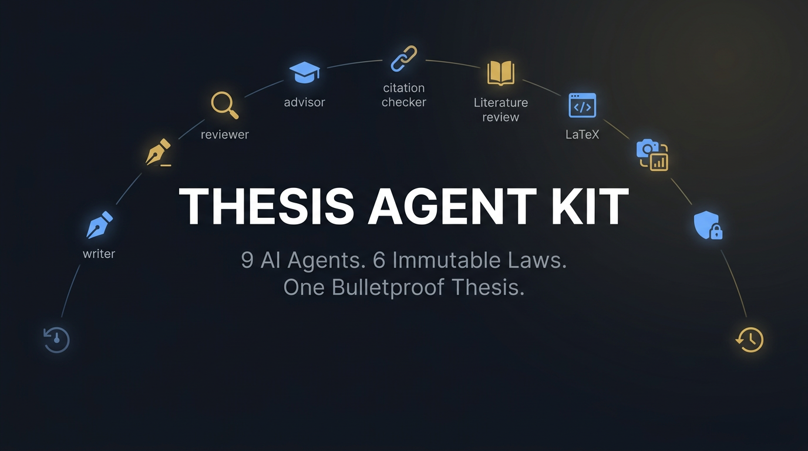

# Thesis Agent Kit

<p align="center">
  <a href="https://sai21112000.github.io/Thesis-Agent-Kit/"></a>
</p>

<p align="center">
  
</p>

<p align="center">
  <em>Stop fighting your thesis alone.</em><br>
  <strong>9 AI specialist agents. 6 immutable writing laws. Every paragraph traceable to a Research Question.</strong><br>
  <em>Domain-agnostic. Plug-and-play. Works for any field.</em>
</p>

<p align="center">
  
  
  
  
  
  <br>
  
  
  
  
</p>

---

## 🤔 What Is This?

**Thesis Agent Kit** turns your AI code editor into a **full research writing command center**. Instead of staring at a blank page, you get a team of 9 specialist AI agents that:

- 🔍 **Interrogate** your research foundations until they're bulletproof (90%+ confidence gate)
- ✍️ **Draft** Q1-quality prose — every paragraph follows T-C-E-L architecture
- 🎯 **Trace** every sentence to your Research Questions (RQ1 / RQ2 / RQ3)
- 📊 **Refuse** to invent data — metrics come from your `RESULTS/` folder or get flagged
- 🔬 **Review** with adversarial 6-pillar critique (Novelty, Methods, Gap, Results, Writing, Citations)
- 📄 **Format** in LaTeX with venue-specific templates
- 📈 **Generate** publication-ready figures (code-first for data; AI for concepts)
- ✅ **Verify** every citation via CrossRef DOI chain

> **Built for rigor, not shortcuts.** This kit does not write your thesis for you. It enforces the standards that get theses defended and papers published.

---

## ⚡ Quick Start

```bash
# 1. Clone
git clone https://github.com/Sai21112000/Thesis-Agent-Kit.git
cd Thesis-Agent-Kit

# 2. Copy to your research project
cp -r .agent/ /path/to/your/thesis/
cp .cursorrules /path/to/your/thesis/       # For Cursor
cp .windsurfrules /path/to/your/thesis/     # For Windsurf
cp PROJECT-CONFIG.md /path/to/your/thesis/

# 3. Fill your config (REQUIRED before anything works)
# Open PROJECT-CONFIG.md and fill every section

# 4. Start your AI editor in the thesis directory
# Then type:
/interview    # Onboarding — builds your config with 90%+ confidence
/write-chapter   # Begin drafting
```

> **For ChatGPT / Claude web users:** Paste `custom-gpt/KNOWLEDGE-BASE.md` into your system instructions. All 9 agents work there too.

---

## 🧠 The 9 Agents

| # | Agent | Slash Command | What It Does |
|---|-------|--------------|--------------|
| 🔴 | **Research Interrogator** | `/interview` | Brutal onboarding. Builds `PROJECT-CONFIG.md` from scratch. Scores every section 0-100%. Blocks writing until 90%+ aggregate. |
| ✍️ | **Research Writer** | `/write-chapter` | Q1-quality prose. 6 Laws enforced. Domain-aware. Section-by-section with quality gates. |
| 🎓 | **Research Advisor** | `/advisor` | Strategic guidance. RQ formulation, research design, defense prep. BDI lifecycle model. |
| 🔍 | **Research Reviewer** | `/review-draft` | Adversarial 6-pillar critique. Pass / Weak / Fail per pillar. Line-level revisions. |
| 🔗 | **Citation Checker** | `/check-citations` | 5-step DOI chain: CrossRef → Scholar → Retraction → Quality → Recency. Verdict: VERIFIED / FLAGGED / FABRICATED. |
| 📚 | **Literature Review** | *(auto Ch.2)* | PRISMA-informed search. Thematic synthesis. Gap formula enforcement. |
| 📐 | **LaTeX Formatting** | *(auto)* | Venue-specific templates. Figure/table environments. BibTeX/biber. Compilation fixes. |
| 📈 | **Figure Generation** | `/figures` | Code-first for data plots (Matplotlib/TikZ). AI imagery for concepts only. `RESULTS/` traceability. |
| 💾 | **Snapshot Manager** | `/snapshot` | Version history without Git. Save, restore, diff, browse any file state. |

---

## 🛡️ The 6 Immutable Laws

These laws govern **every paragraph** produced by any agent. No override. No exceptions.

| # | Law | What It Means |
|---|-----|--------------|
| 1 | **RQ Traceability** | Every paragraph traces to RQ1, RQ2, or RQ3. Orphan paragraphs are deleted. |
| 2 | **No Fluff** | Forbidden: *"it is important"*, *"in today's world"*, *"as mentioned"*, *"obviously"*. If a sentence adds nothing, it goes. |
| 3 | **Register** | No contractions. Correct tense per section. No vague quantifiers ("many" → "numerous"). |
| 4 | **Citation Integrity** | Every factual claim needs a citation or gets flagged `[CITATION NEEDED]`. No fabricated references. |
| 5 | **Voice Discipline** | Passive in Methods/Results. Active declarative topic sentences. No exceptions. |
| 6 | **T-C-E-L Architecture** | **T**opic → **C**ite → **E**xplain → **L**ink. Every body paragraph. Every time. |

---

## 🗺️ How It Works

```
┌─────────────────────────────────────────────────────────┐
│                    YOU (Researcher)                      │
│         Fill PROJECT-CONFIG.md with your research        │
└──────────────────────┬──────────────────────────────────┘
                       │
                       ▼
              ┌────────────────┐
              │  /interview    │  Interrogator validates config
              │  90%+ gate     │  Scores every section 0-100%
              └───────┬────────┘
                      │ READY
                      ▼
              ┌────────────────┐
              │ /write-chapter │  Writer drafts section-by-section
              │ + domain module│  Quality gate after each section
              └───────┬────────┘
                      │
           ┌──────────┼──────────┐
           ▼          ▼          ▼
     ┌──────────┐ ┌────────┐ ┌──────────┐
     │ /review  │ │/figures│ │  /check  │
     │ -draft   │ │        │ │-citations│
     └──────────┘ └────────┘ └──────────┘
           │          │          │
           └──────────┼──────────┘
                      ▼
              ┌────────────────┐
              │  LaTeX + PDF   │  latex-formatting auto-applied
              │  Final thesis  │
              └────────────────┘
```

---

## 📂 Project Structure

```
Thesis-Agent-Kit/
├── 📋 PROJECT-CONFIG.md          ← Fill this FIRST (single source of truth)
├── 📖 README.md                  ← You are here
├── 🚀 FIRST-TIMERS-GUIDE.md     ← Zero to first draft in 15 min
├── 📝 CHANGELOG.md
├── ⚙️ .cursorrules               ← Auto-loads in Cursor
├── ⚙️ .windsurfrules             ← Auto-loads in Windsurf
│
├── 🤖 .agent/
│   ├── CORE-LAWS.md              ← 6 Immutable Laws
│   ├── CORE-STRUCTURE.md         ← Universal IMRaD chapter architecture
│   ├── CORE-QA.md                ← 6-pillar quality rubric
│   │
│   ├── skills/                   ← 9 specialist agents
│   │   ├── research-interrogator ← 🔴 Onboarding + 90% confidence gate
│   │   ├── research-writer       ← ✍️ Q1 prose, domain-aware drafting
│   │   ├── research-advisor      ← 🎓 RQ strategy, research design
│   │   ├── research-reviewer     ← 🔍 Adversarial 6-pillar critique
│   │   ├── citation-checker      ← 🔗 5-step CrossRef verification
│   │   ├── literature-review     ← 📚 PRISMA, thematic synthesis
│   │   ├── latex-formatting      ← 📐 LaTeX templates, booktabs, biber
│   │   ├── figure-generation     ← 📈 Diagrams, code-first plots
│   │   └── snapshot-manager      ← 💾 Version history without Git
│   │
│   ├── domains/                  ← Plug-and-play domain expertise
│   │   ├── computer-vision/      ← YOLO, SAM, mAP, GSD, UAV
│   │   ├── nlp/                  ← Transformers, BLEU, ROUGE, F1
│   │   ├── reinforcement-learning/ ← PPO, reward functions, seeds
│   │   ├── biomedical/           ← CONSORT, STROBE, RCT, AUC-ROC
│   │   ├── social-science/       ← Thematic analysis, trustworthiness
│   │   └── _template/            ← Scaffold for new domains
│   │
│   └── workflows/                ← Command orchestrators
│       ├── write-chapter.md
│       ├── review-draft.md
│       ├── check-citations.md
│       ├── snapshot.md
│       ├── restore.md
│       └── history.md
│
├── 📁 custom-gpt/
│   └── KNOWLEDGE-BASE.md        ← Paste into ChatGPT/Claude web
│
├── 📁 examples/
│   └── sample-PROJECT-CONFIG.md  ← Pre-filled reference (oil palm CV)
│
├── 📁 .snapshots/                ← Version history storage
└── 📁 docs/                      ← Assets and documentation
```

---

## 🏗️ The 3-Layer Architecture

<table>
<tr>
<th>Layer</th>
<th>What It Contains</th>
<th>Who Maintains It</th>
</tr>
<tr>
<td><strong>🔒 Core Layer</strong></td>
<td>6 Laws, IMRaD structure, 6-pillar QA rubric</td>
<td>Kit maintainers (domain-agnostic, never edited per project)</td>
</tr>
<tr>
<td><strong>🧩 Domain Layer</strong></td>
<td>Terminology banks, metrics, forbidden phrases, evaluation norms</td>
<td>Community (add new domains by copying <code>_template/</code>)</td>
</tr>
<tr>
<td><strong>👤 Project Layer</strong></td>
<td><code>PROJECT-CONFIG.md</code> — your title, RQs, methods, data, results</td>
<td>You (fill once, all agents read it)</td>
</tr>
</table>

---

## 🌐 Available Domains

| Domain | Key Metrics & Features | Module |
|--------|----------------------|--------|
| 🖼️ **Computer Vision** | mAP@50, YOLO, SAM, ablation tables, GIS/UAV | `computer-vision/` |
| 📝 **NLP** | macro F1, BLEU, ROUGE, BERTScore, transformers, LoRA | `nlp/` |
| 🎮 **Reinforcement Learning** | PPO, reward functions, N≥5 seeds, convergence | `reinforcement-learning/` |
| 🏥 **Biomedical** | CONSORT, STROBE, RCT, AUC-ROC, NNT, sensitivity | `biomedical/` |
| 👥 **Social Science** | Thematic analysis, trustworthiness, reflexivity, qualitative coding | `social-science/` |
| ➕ **Your Domain** | Copy `_template/`, fill terminology + metrics, declare in config | `_template/` |

---

## 📋 All Commands

| Command | Agent | Description |
|---------|-------|-------------|
| `/interview` | 🔴 Interrogator | Build or stress-test `PROJECT-CONFIG.md` — 90%+ confidence gate |
| `/write-chapter` | ✍️ Writer | Guided chapter drafting (Ch.1–5) with quality gates |
| `/review-draft` | 🔍 Reviewer | Adversarial 6-pillar critique with line-level revisions |
| `/check-citations` | 🔗 Citation Checker | 5-step DOI verification: VERIFIED / FLAGGED / FABRICATED |
| `/advisor` | 🎓 Advisor | Strategic RQ guidance, research design, defense prep |
| `/figures` | 📈 Figure Gen | Diagrams and plots — code-first for data, AI for concepts |
| `/snapshot [label]` | 💾 Snapshots | Save timestamped file version |
| `/restore [target]` | 💾 Snapshots | Roll back to a previous snapshot |
| `/history [file]` | 💾 Snapshots | Browse all snapshots for a file |

---

## 🎯 The Confidence Gate (`/interview`)

Before you write a single word, the **Research Interrogator** validates your research foundations:

```
CONFIDENCE SCORECARD
━━━━━━━━━━━━━━━━━━━━━━━━━━━━━━━━━━━━━━━━━━━━━━━━━━━━━━
Section                     Score    Weight   Weighted
────────────────────────────────────────────────────────
1-2  Identity & Domain       92%     10%      9.2
3    Research Problem         88%     15%     13.2
4    Research Gap             95%     15%     14.3
5    Aim                      90%      5%      4.5
6    Research Questions       93%     20%     18.6
7    Hypotheses               85%     10%      8.5
8    Method Mapping           91%     10%      9.1
9    Scope                    88%      5%      4.4
10   Contributions            90%      5%      4.5
11-15 Data & Experiments      PENDING  5%      ---
────────────────────────────────────────────────────────
AGGREGATE CONFIDENCE:                          86.3%
━━━━━━━━━━━━━━━━━━━━━━━━━━━━━━━━━━━━━━━━━━━━━━━━━━━━━━
VERDICT: CONDITIONAL — may draft Ch.1-2; fix Hypotheses before Ch.3
```

| Aggregate | Verdict | What Happens |
|-----------|---------|-------------|
| **≥ 90%** | ✅ READY | Full drafting unlocked |
| **75–89%** | ⚠️ CONDITIONAL | Ch.1-2 only; fix flagged sections |
| **50–74%** | ❌ NOT READY | No drafting; address all weak sections |
| **< 50%** | 🚫 BLOCKED | Fundamental rethink needed |

---

## 📊 Quality Rubric (6 Pillars)

Every draft is graded against these pillars via `/review-draft`:

| Pillar | Pass ✅ | Weak ⚠️ | Fail ❌ |
|--------|---------|---------|--------|
| **Novelty** | Specific, measurable contribution claims | Vague "we propose a new approach" | No discernible novelty |
| **Methodology** | Complete method chain + ablation | Missing reproducibility details | Fundamentally flawed |
| **Gap Integrity** | ≥3 citations, gap formula applied | Under-cited or too broad | No gap statement |
| **Result Validity** | Consistent, honestly hedged | Minor inconsistencies | Overclaimed or fabricated |
| **Writing Quality** | T-C-E-L, formal register, no fluff | Occasional lapses | Informal, disorganized |
| **Citation Integrity** | DOI-verified, ≥60% within 5 years | Minor gaps | Fabricated references |

---

## 🚀 Workflow: Zero to Defended Thesis

```
Step 1                Step 2              Step 3              Step 4              Step 5
┌──────────┐    ┌──────────────┐    ┌──────────────┐    ┌──────────┐    ┌──────────────┐
│ /interview│───▶│/write-chapter│───▶│ /review-draft│───▶│ /figures │───▶│/check-       │
│ Build     │    │ Draft Ch.1-5 │    │ 6-pillar QA  │    │ Plots &  │    │ citations    │
│ config    │    │ section by   │    │ revise until │    │ diagrams │    │ DOI verify   │
│ 90%+ gate │    │ section      │    │ STRONG       │    │          │    │ all refs     │
└──────────┘    └──────────────┘    └──────────────┘    └──────────┘    └──────────────┘
                                                                               │
                                                                               ▼
                                                                        ┌──────────────┐
                                                                        │ LaTeX + PDF   │
                                                                        │ Submit / Defend│
                                                                        └──────────────┘
```

---

## 🔧 Works With

| Platform | How |
|----------|-----|
| **Cursor** | Drop `.cursorrules` + `.agent/` into your project. Commands auto-load. |
| **Windsurf** | Drop `.windsurfrules` + `.agent/` into your project. Same behavior. |
| **ChatGPT** (Custom GPT) | Paste `custom-gpt/KNOWLEDGE-BASE.md` into system instructions. |
| **Claude** (Projects) | Paste `custom-gpt/KNOWLEDGE-BASE.md` into project knowledge. |
| **Any LLM** | Feed the KNOWLEDGE-BASE as system prompt. Core laws + commands work universally. |

---

## 📦 Installation

### Option A: Clone the Full Kit

```bash
git clone https://github.com/Sai21112000/Thesis-Agent-Kit.git
```

### Option B: Copy Into Existing Project

```bash
# Copy the agent system
cp -r Thesis-Agent-Kit/.agent/ /your/thesis/
cp Thesis-Agent-Kit/.cursorrules /your/thesis/
cp Thesis-Agent-Kit/PROJECT-CONFIG.md /your/thesis/

# Optional
cp Thesis-Agent-Kit/FIRST-TIMERS-GUIDE.md /your/thesis/
cp -r Thesis-Agent-Kit/examples/ /your/thesis/
```

### Option C: ChatGPT / Claude Web

1. Open `custom-gpt/KNOWLEDGE-BASE.md`
2. Copy entire contents
3. Paste into ChatGPT Custom GPT system instructions or Claude Project knowledge
4. Start with: *"I want to set up my thesis. Run /interview."*

---

## 🆕 Adding a New Domain

```bash
# 1. Copy template
cp -r .agent/domains/_template/ .agent/domains/my-domain/

# 2. Fill the template with your field's:
#    - Terminology bank
#    - Evaluation metrics
#    - Forbidden phrases
#    - Canonical references

# 3. Declare in PROJECT-CONFIG.md
#    domain: my-domain

# Done — all agents now use your domain expertise
```

---

## ❓ FAQ

<details>
<summary><strong>Does this write my thesis for me?</strong></summary>

No. It enforces structure, quality, and rigor. You provide the ideas, data, and decisions. The agents draft prose that meets Q1 standards, but you review and own every word.
</details>

<details>
<summary><strong>What if I don't have experiment results yet?</strong></summary>

You can draft Chapters 1-3 (Introduction, Literature Review, Methodology). Chapter 4 (Results) is **blocked** until you fill Sections 11-15 in `PROJECT-CONFIG.md`. The system never invents data.
</details>

<details>
<summary><strong>Can I use this for a journal paper, not a thesis?</strong></summary>

Yes. Set `Document Type: journal-paper` in `PROJECT-CONFIG.md`. The 5-chapter structure maps to IMRaD sections. Word counts and section orders adapt.
</details>

<details>
<summary><strong>What's the /interview command?</strong></summary>

A brutal, adversarial onboarding session. The Research Interrogator asks hard questions about your research problem, gap, RQs, and methods. It scores each section 0-100% and refuses to let you start writing until aggregate confidence reaches 90%. Think: thesis defense examiner meets due diligence.
</details>

<details>
<summary><strong>Do I need all 9 agents?</strong></summary>

They load on-demand. `/write-chapter` loads the writer + domain module. `/review-draft` loads the reviewer + QA rubric. You never pay for agents you don't invoke.
</details>

<details>
<summary><strong>Can I customize the laws or quality standards?</strong></summary>

The 6 Laws in `CORE-LAWS.md` are intentionally immutable — they represent the minimum bar for defensible academic writing. Domain modules, chapter word counts, and scoring weights can be customized in `PROJECT-CONFIG.md` and domain files.
</details>

---

## 📜 Changelog

See [CHANGELOG.md](CHANGELOG.md) for full version history.

**Latest: v2.1.0** — Research Interrogator (`/interview`), Figure Generation (`/figures`), README redesign.

---

## 🤝 Contributing

1. Fork the repo
2. Add your domain module, fix a bug, or improve a skill
3. Submit a PR

Particularly welcome:
- **New domain modules** (economics, chemistry, education, law...)
- **Venue-specific LaTeX templates**
- **Translations** of the KNOWLEDGE-BASE

---

## 📄 License

MIT — use it, fork it, adapt it, publish with it.

---

## 🔗 Links

[](https://github.com/Sai21112000/Thesis-Agent-Kit)

---

<p align="center">
  <strong>9 agents. 6 laws. Your thesis, defended.</strong><br>
  <em>Stop procrastinating. Type <code>/interview</code>.</em>
</p>
# Thesis-Agent-Kit
